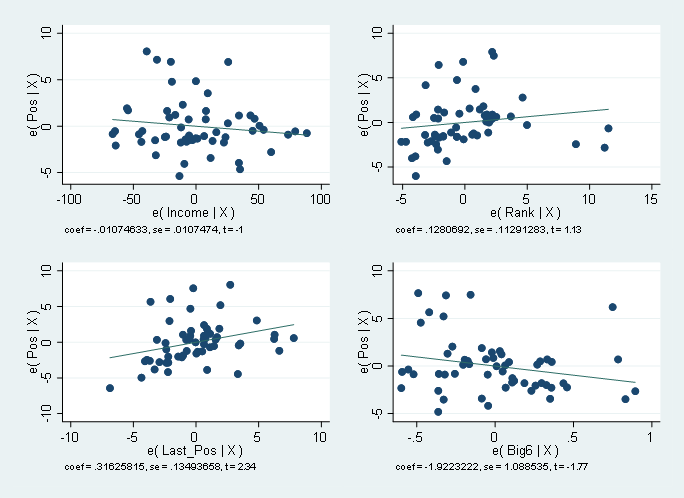
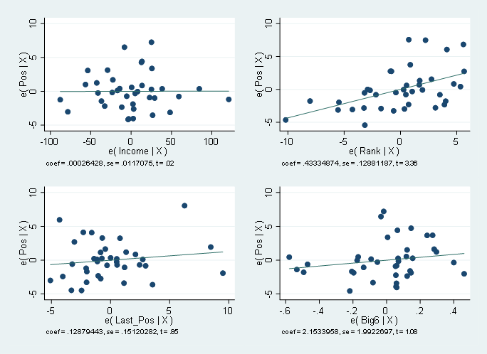
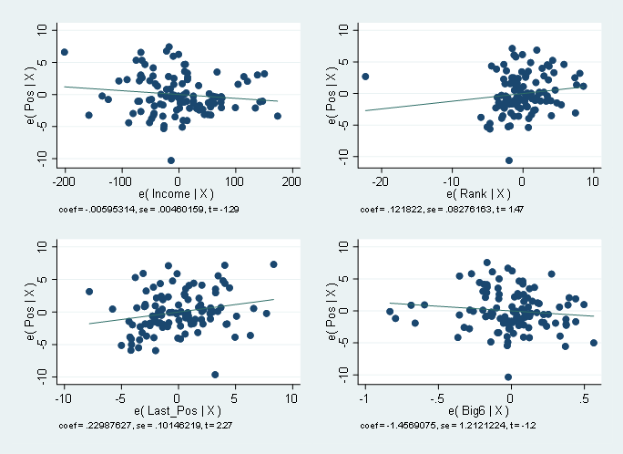

```{r, setup, include = FALSE, message=FALSE}
# load packages that are going to be used
library(mosaic)      # this loads ggformula (for plotting), etc. too
library(fastR2)      # some data sets
library(pander)      # nicely formatted tables with pander()
library(knitr)       # so you can use kable() for tables
library(patchwork)   # for combining plots
library(ggplot2)
library(lmtest)
library(olsrr)

# data wrangling
library(tidyverse)

# several packages for bayesian stuff -- more may come later
library(rethinker)  # related to text
library(tidybayes)    
library(bayesplot)
#library(CalvinBayes)
library(jtools)

# Some customization. You can alter or delete as desired (if you know what you are doing).

theme_set(theme_bw())     # change theme for ggplot2/ggformula

knitr::opts_chunk$set(
  tidy = FALSE,     # display code as typed (rather than reformatted)
  fig.width = 4,    # adjust this to make figures wider or narrower
  fig.height = 2.5, # adjust this to make figures taller or shorrter
  size = "small",   # slightly smaller font for code
  warning = FALSE,
  message = FALSE)
```


<!-- A few math abbreviations -->

\newcommand{\Prob}{\operatorname{Pr}}
\newcommand{\Binom}{\operatorname{Binom}}
\newcommand{\Unif}{\operatorname{Unif}}
\newcommand{\Triangle}{\operatorname{Triangle}}
\newcommand{\Norm}{\operatorname{Norm}}
\newcommand{\Beta}{\operatorname{Beta}}
\newcommand{\E}{\operatorname{E}}
\newcommand{\Var}{\operatorname{Var}}
\newcommand{\SD}{\operatorname{SD}}

```{r, include = FALSE}
EPL_standings <- read.csv('EPL Standings 2000-2022.csv') |>
  select('Season', 'Pos', 'Team') |>
  rename('Club' = 'Team') |>
  mutate(Season = case_when(
    Season == '2000-01' ~ '2001',
    Season == '2001-02' ~ '2002',
    Season == '2002-03' ~ '2003',
    Season == '2003-04' ~ '2004',
    Season == '2004-05' ~ '2005',
    Season == '2005-06' ~ '2006',
    Season == '2006-07' ~ '2007',
    Season == '2007-08' ~ '2008',
    Season == '2008-09' ~ '2009',
    Season == '2009-10' ~ '2010',
    Season == '2010-11' ~ '2011',
    Season == '2011-12' ~ '2012',
    Season == '2012-13' ~ '2013',
    Season == '2013-14' ~ '2014',
    Season == '2014-15' ~ '2015',
    Season == '2015-16' ~ '2016',
    Season == '2016-17' ~ '2017',
    Season == '2017-18' ~ '2018',
    Season == '2018-19' ~ '2019',
    Season == '2019-20' ~ '2020',
    Season == '2020-21' ~ '2021',
    Season == '2021-22' ~ '2022'
  )) |>
  rename('Year' = 'Season') |>
  mutate(Big6 = case_when(
    Club == 'Manchester United' ~ 1,
    Club == 'Manchester City' ~ 1,
    Club == 'Arsenal' ~ 1,
    Club == 'Liverpool' ~ 1,
    Club == 'Chelsea' ~ 1,
    Club == 'Tottenham' ~ 1
  )) |>
  mutate(Big6 = coalesce(Big6, 0)) |>
  mutate(Champion = case_when(
    Pos == 1 ~ 1
  ))
```

```{r, include = FALSE}
finances <- read.csv('finances.csv', stringsAsFactors=FALSE, fileEncoding="latin1") |>
  select('Rank', 'Club', 'Income..Million.Euros.', 'Country', 'Year') |>
  rename('Income' = 'Income..Million.Euros.') |>
  mutate('Income' = as.integer(Income))
```

```{r, include = FALSE}
data <- merge(finances, EPL_standings, by = c("Club", "Year")) 

data <- data |>
  group_by(Club) |>
  mutate(Last_Pos = as.numeric(lag(Pos))) |>
  ungroup()
  

sample_n(data, 25)
```

\newpage

## Abstract:

|   In 2009, the Union of European Football Association (UEFA) determined that more than half of 655 eligible European clubs incurred a net loss over the previous year. While a small proportion were capable to sustain heavy-losses year-to-year because of wealthy owners, it was determined that at least 20% of the clubs surveyed would be in financial peril quickly while chasing success. Thus Financial Fair Play (FFP) was created. The equation was that any money from the club's outgoing transfers, employee benefits and wages, amortization of transfers, finance costs, and dividends will be put again the club's income from gate receipts, TV revenue, advertising, merchandising, disposal of tangible fixed assets, finance, sales of players and prize money. All money spent by the club on infrastructure, training facilities or youth development will not be taken into account. Clubs are permitted to spend up to five million euros more than they earn per three year assessment period. However, big however, it can exceed that level to a limit if it is covered by a direct contribution from the club's owner. [@UEFA]

|   Thus, this brings us to the question of what did FFP accomplish when announced in 2009 and implemented in the 2013-2014 season? The economic question is; did FFP implementation widen the gap between the wealthy clubs and non-wealthy clubs based on their finishes in the standings over the years? This is important because the goals of FFP were to make it a more fair playing field, but to also ensure clubs don't bankrupt themselves while chasing success. By showing 3 different linear regression models that factor a club's income, position in the standings from the prior year, their financial ranking according to Deloitte Football Money League, and if the club is deemed one of the big six clubs. The Deloitte Football Money League is "an annual profile of the highest revenue generating clubs in world football" and they rank and include analysis on the top 20-30 teams in the world. [@Deloitte] The Premier League 'Big 6' is an informal name for Arsenal, Chelsea, Liverpool, Manchester City, Manchester United, and Tottenham Hotspur because "they are the most consistently successful teams in the division... [with] the biggest stadiums, broadest fan bases, and the healthiest bank accounts." [@Goal] These variables should help correlate the effects of FFP on teams' success based on their income, ranking, previous position, and the big 6.

## Model Fitting

|   Some data explanation. First, Income is measured in the millions of euros. Rank is determined from 1 to 30 with 1 being the most income in the world. Last_Pos is determined by the team's position in the standings at the end of the prior year, and Big6 is an indicator if the club is one of Arsenal, Chelsea, Liverpool, Manchester City, Manchester United, or Tottenham Hotspur. The year data is the year the season ended, so 2009 means the 2008-2009 season and so on. Lastly, to clarify the model, the lower the result, as long as greater than zero, the better. The model is running a linear regression on Pos which is the variable for the teams' standing in the current season, so they want to be 1 which means they are on the top of the table/winning whereas 20 means they are at the bottom of the table/losing. The model is composed of sums because the different variables are not interactive with each other to justify any multiplication but it is rather a compilation of the variables.

### Figure 1. 2001-2009 Linear Model Summary

```{r, echo= FALSE}
model09 <- data |>
  filter(Year <= 2009) |>
  lm(formula = Pos ~ Income + Rank + Last_Pos + Big6, na.action = na.exclude)
summ(model09, confint = TRUE, digits = 3)
```

### Figure 2. 2001-2009 Model Linear Regression Post-Estimation Plots
```{r, out.width="450px", echo= FALSE}

```

\newpage

### Figure 3. 2010-2013 Linear Model Summary
```{r, echo= FALSE}
model09.13 <- data |>
  filter(Year > 2009 | Year <=2013) |>
  lm(formula = Pos ~ Income + Rank + Last_Pos + Big6, na.action = na.exclude)
summ(model09.13, confint = TRUE, digits = 3)
```

### Figure 4. 2010-2013 Model Linear Regression Post-Estimation Plots
```{r, out.width="450px", echo= FALSE}

```

\newpage

### Figure 5. 2014-2022 Linear Model Summary
```{r, echo= FALSE}
model13 <- data |>
  filter(Year > 2013) |>
  lm(formula = Pos ~ Income + Rank + Last_Pos + Big6, na.action = na.exclude)
summ(model13, confint = TRUE, digits = 3)
```

### Figure 6. 2014-2022 Model Linear Regression Post-Estimation Plots
```{r, out.width="450px", echo= FALSE}

```

\newpage

## Interpretation Of Models

Figures 1 and 2
| For the years 2001-2009 where FFP had not been created or mentioned, the model produces an intercept of 5.543, Income is -0.011, Rank is 0.128, Last_Poss is 0.316, and Big6 is -1.922. This means that Big6 is the highest indicator of a team having a small position and therefore a better result. Income has a small correlation towards a better position while also the higher Rank and Last_Poss are, the likelihood that Position will also be higher and therefore bad.


Figures 3 and 4.
| For the years 2009-2013 where FFP had been developed but not yet implemented, the model produces an intercept of 2.937, Income is 0, Rank is 0.207, Last_Pos is 0.291, and Big6 is -1.790. In comparison to 2001-2009, Income has slightly less effect than before, the intercept is much different by almost 2.6 positional spots, Rank has become about twice as important, the position from last season remains about as important, and Big6 remains heavily important but not quite as important as before.


Figures 5 and 6.
| For the years 2013 - 2022 where FFP has now been fully implemented, the model produced an intercept of 6.739, wow!, Income is -0.006, Rank is 0.122, Last_Pos is 0.230, and Big6 is -1.457. The intercept has increased a lot, even past the intercept for 2002-2009, Income is still around the same, Rank returned to its influence from 2002-2009, Last_Pos has decreased in influence again, and Big6 has also decreased in influence again.


## F Test for Heteroskedasticity

### Figure 7. 2001-2009 Model F-Test
```{r, echo= FALSE}
model09.2 <- data |>
  filter(Year <= 2009) |>
  lm(formula = Pos ~ Income + Rank + Last_Pos + Big6)
ols_test_f(model09.2)
```


### Figure 8. 2010-2013 Model F-Test
```{r, echo= FALSE}
model09.13.2 <- data |>
  filter(Year > 2009 | Year <=2013) |>
  lm(formula = Pos ~ Income + Rank + Last_Pos + Big6)
ols_test_f(model09.13.2)
```


### Figure 9. 2014-2022 Model F-Test
```{r, echo= FALSE}
model13.2 <- data |>
  filter(Year > 2013) |>
  lm(formula = Pos ~ Income + Rank + Last_Pos + Big6)
ols_test_f(model13.2)
```

The F-Test for each model fails the assumption of heteroskedasticity because the null hypothesis that the models are homogeneous must be rejected at a p-value < 0.05. 


## Ramsey RESET Test

### Figure 10. 2001-2009 Model Ramsey RESET Test
```{r, echo= FALSE}
resettest(model09, power = 4, type = "regressor")
```


### Figure 11. 2010-2013 Model Ramsey RESET Test
```{r, echo= FALSE}
resettest(model09.13, power = 4, type = "regressor")
```


### Figure 12. 2014-2022 Model Ramsey RESET Test
```{r, echo= FALSE}
resettest(model13, power = 4, type = "regressor")
```

Running the RESET Test on all three models shows p-values for the F-stat at 5.8%, 79.7%, and 29.6% which means we fail to rejest the Ramsey RESET test null hypothesis. This indicates that the functional form is correct and that the models do not suffer from omitted variables.

\newpage

## Implications

|   The first point to mention is that each model failed the F Test for Heteroskedasticity and thus these results are tainted slightly since this means the population used in the regression contains unequal variance and thus the analysis results may be invalid but not necessarily. In hindsight, this may be due to the data being centered around the Deloitte Football Money League and thus isn't taking into account the teams that weren't among the richest in Europe for that season. This would support the heteroskedasticity seen in the model and would be something to do different if the models were recreated. If this analyses were to be continued, the data should be redone and even more interestingly expanded to contain the top 5 leagues of europe since most of the 30 teams each year in the Deloitte Football Money League report would be continued and see how they do comparitively. It would also be interesting to add European tournament result of the clubs to see how clubs do against each other rather than just their own league.


|   The results of the linear regressions models have some interesting things to say about FFP. The first is that since FFP was announced and then implemented, being one of the Big 6 has consistently decreased in correlation to standing position and therefore maybe FFP is giving more teams opportunity to finish above the Big 6 and thus more variability to the league. Another interesting observation is the dip in the intercept after FFP was announced but the massive spike back up after FFP was implemented. This means that if all other values are 0, such as 0 income, no rank, no last position, and not part of the Big 6, teams would on average be about 6.8 places behind other teams. This suggests that the factors of more income, better rank and positioning, and being part of the Big 6 has created more separation between the teams than after FFP was announced but not yet implemented. This is interesting because to hypothesize that when FFP was announced, it greatly effected teams and made the playing field more even financially, as seen by the model, but once it was implemented, it actually seemed to widen the gap between the elite financially and those who aren't.

|   This economic question is important for the integrity of football across the world because FFP should become more about giving teams equal opportunity and chances rather than just the richest teams are always the best. If it can be shown that richer teams on average have much more success than their counterparts, something should be done about it for the sake of the sport. It would also target one of the biggest problems in football right now; inflated player transfer fees. Since FFP, player transfer fees have skyrocketed because each team needs to balance their financial books, but it has only snowballed out of control where even somewhat normal players are being bought for 50-100 million euros a piece. This is unhealthy for the sport and it has also become a place where wealthy owners invest lots of money into wonder kids hoping to sell them for profit in a few years. Overall this is unhealthy for the sport and the longevity of true competition rather than wealthy monopolies.

\newpage

# References
